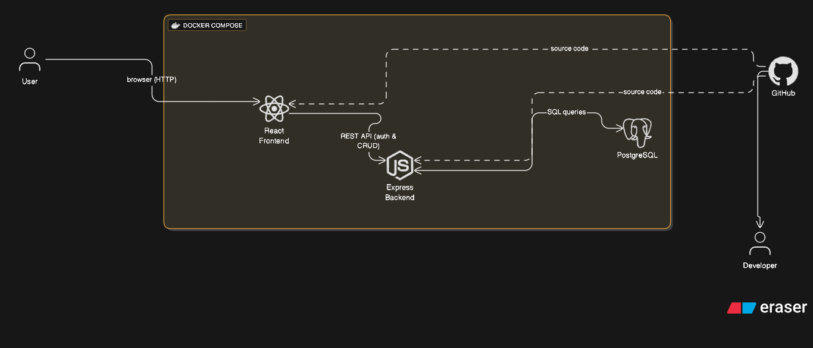

# Book Inventory Application

A containerized full-stack application for managing book inventory with user authentication and CRUD operations.

## System Architecture



The application consists of three main components orchestrated with Docker Compose:

- **React Frontend** - User interface for authentication and book management
- **Express.js Backend** - REST API handling business logic and authentication
- **PostgreSQL Database** - Persistent storage for users and book data

## Features

- 🔐 **User Authentication & Authorization** - Secure login system with JWT tokens
- 📚 **Book Inventory Management** - Complete CRUD operations for books
- 🗄️ **Metadata Tracking** - Store and manage detailed book information
- 🐋 **Containerized Deployment** - Easy setup and deployment with Docker Compose

## Tech Stack

### Frontend
- React
- Modern CSS/Tailwind CSS

### Backend
- Node.js
- Express.js
- JWT for authentication
- bcrypt for password hashing (or other encryption technique)

### Database
- PostgreSQL

### DevOps
- Docker & Docker Compose
- GitHub (Version Control)

## Prerequisites

- Docker 
- Docker Compose 
- Git
- Node.js  - for local development

## Getting Started

### 1. Clone the Repository

```bash
git clone https://github.com/BibeshT-TXST/Project_GitGud.git
cd Project_GitGud
```

### 2. Environment Configuration

Create a `.env` file in the root directory:

```env
# Database
POSTGRES_USER=bookuser
POSTGRES_PASSWORD=your_secure_password
POSTGRES_DB=bookstore
DATABASE_URL=postgresql://bookuser:your_secure_password@db:5432/bookstore

# Backend
PORT=8080
JWT_SECRET=your_jwt_secret_key
NODE_ENV=production

# Frontend
REACT_APP_API_URL=http://localhost:8080
```

### 3. Run with Docker Compose

```bash
# Build and start all containers
docker-compose up -d

# View logs
docker-compose logs -f

# Stop all containers
docker-compose down
```

The application will be available at:
- **Frontend**: http://localhost:3000
- **Backend API**: http://localhost:8080
- **Database**: localhost:5432

## Project Structure

```
book-inventory-app/
├── frontend/              # React application
│   ├── src/
│   │   ├── components/   # Reusable components
│   │   ├── pages/        # Page components
│   │   ├── services/     # API service layer
│   │   └── App.js
│   ├── Dockerfile
│   └── package.json
├── backend/              # Express API
│   ├── src/
│   │   ├── controllers/  # Request handlers
│   │   ├── models/       # Database models
│   │   ├── routes/       # API routes
│   │   ├── middleware/   # Auth & validation
│   │   └── server.js
│   ├── Dockerfile
│   └── package.json
├── database/             # Database scripts
│   └── init.sql         # Initial schema
├── docker-compose.yml
├── .env.example
└── README.md
```

## API Endpoints

### Authentication
- `POST /api/auth/register` - Register new user
- `POST /api/auth/login` - User login
- `GET /api/auth/profile` - Get user profile (protected)

### Books
- `GET /api/books` - Get all books (protected)
- `GET /api/books/:id` - Get book by ID (protected)
- `POST /api/books` - Create new book (protected)
- `PUT /api/books/:id` - Update book (protected)
- `DELETE /api/books/:id` - Delete book (protected)

## Acknowledgments

- [React documentation](https://react.dev)
- [Express.js guides](https://expressjs.com)
- [PostgreSQL documentation](https://www.postgresql.org/docs/current/)
- [Docker Compose Docs](https://docs.docker.com/compose/intro/compose-application-model/)
